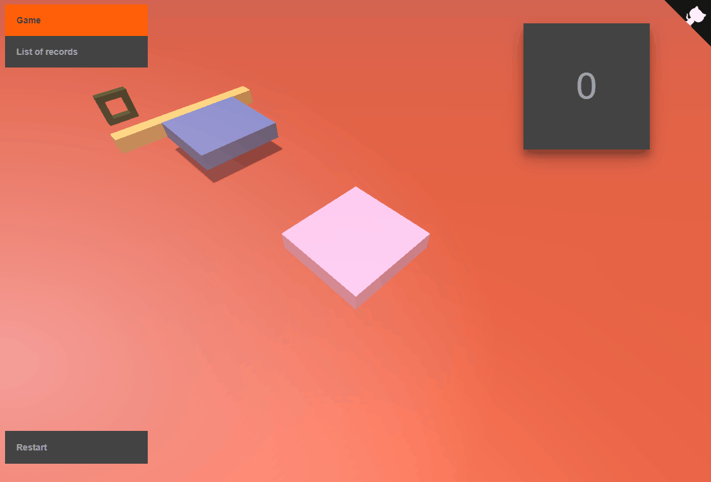

# Stack game

[](https://github.com/darteil/StackGame/blob/master/LICENSE.md) [](https://github.com/darteil/StackGame/releases) [](https://gitlab.com/darteil_projects/StackGame/commits/master)



### Installation and run project.

Switch to dev branch.
Install dependencies and devDependencies and start.

```sh
$ npm install
$ npm start
```

### Other

Check code formatting errors.

```sh
$ npm run lint
```

### Using libraries

[Tween.js](https://github.com/tweenjs/tween.js/),
[ThreeJs](https://github.com/mrdoob/three.js/)

### License

MIT License, Copyright (c) 2018-2021 Romanov Yuri
